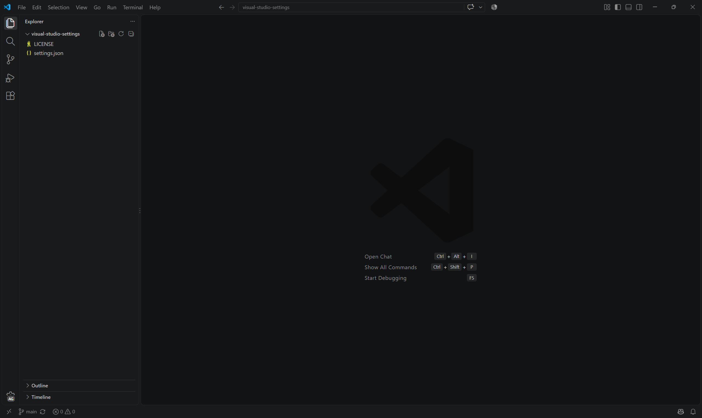
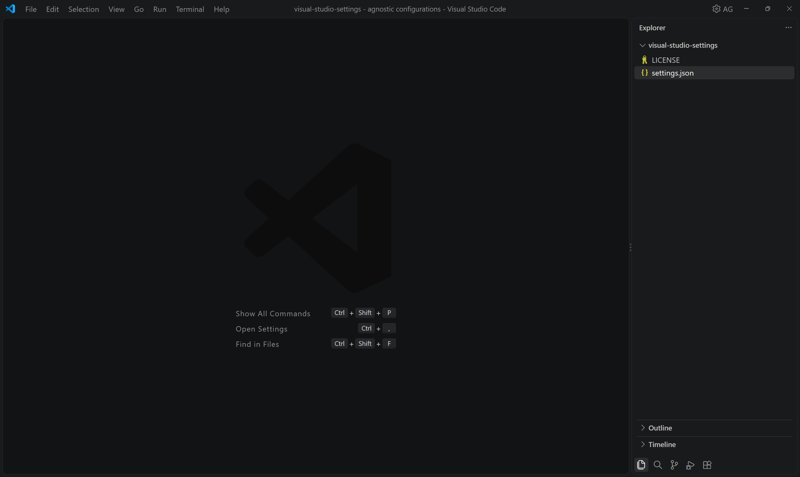

# 🛠️ VS Code Minimalist & Distraction-Free Setup

Uma configuração ultralimpas para o Visual Studio Code, focada em maximizar a área útil do editor, eliminar distrações visuais da UI, desativar coletas de dados/telemetria e desabilitar recursos de IA e MCP integrados.

---

## 🖼️ Comparativo (Antes vs Depois)

| Antes | Depois |
| :---: | :---: |
|  |  |

---

## 🎯 Destaques da Configuração

- **Interface Limpa (Distraction-Free):** Sem barra de status, minimapa, breadcrumbs, barra de título/comandos ou barras de rolagem visíveis.
- **Side Bar à Direita:** Mantém a barra lateral no lado direito (`workbench.sideBar.location: right`) para evitar que o código "pule" na tela ao abrir/fechar o explorador.
- **Cursor de Terminal/Retro:** Cursor em bloco fixo sem piscar (`block` + `solid`).
- **Privacidade & Desempenho:** Telemetria desativada e recursos de IA (`chat.disableAIFeatures`) desabilitados.
- **Tipografia:** Suporte a ligaturas de fonte ativado tanto no editor quanto no terminal integrado.

---

## 📋 Arquivo `settings.json`

Substitua o conteúdo do seu `settings.json` local pelo bloco abaixo:

```json
{
  // --- IA & Ferramentas ---
  "chat.disableAIFeatures": true,
  "chat.mcp.access": "none",

  // --- Editor & Tipografia ---
  "editor.fontSize": 13,
  "editor.lineHeight": 1.2,
  "editor.tabSize": 4,
  "editor.insertSpaces": true,
  "editor.fontLigatures": true,
  "editor.cursorStyle": "block",
  "editor.cursorBlinking": "solid",
  "editor.lineNumbers": "off",
  "editor.renderLineHighlight": "none",

  // --- Elementos Visuais do Editor ---
  "editor.minimap.enabled": false,
  "breadcrumbs.enabled": false,
  "editor.scrollbar.horizontal": "hidden",
  "editor.scrollbar.vertical": "hidden",

  // --- Workbench & Layout ---
  "window.zoomLevel": 1.25,
  "window.commandCenter": false,
  "workbench.startupEditor": "none",
  "workbench.statusBar.visible": false,
  "workbench.activityBar.location": "bottom",
  "workbench.sideBar.location": "right",
  "workbench.secondarySideBar.defaultVisibility": "hidden",
  "workbench.layoutControl.enabled": false,
  "workbench.navigationControl.enabled": false,

  // --- Zen Mode Customizado ---
  "zenMode.fullScreen": false,
  "zenMode.centerLayout": false,

  // --- Terminal ---
  "terminal.integrated.fontLigatures.enabled": true,
  "terminal.integrated.lineHeight": 1.2,

  // --- Telemetria & Privacidade ---
  "telemetry.telemetryLevel": "off",
  "telemetry.feedback.enabled": false
}